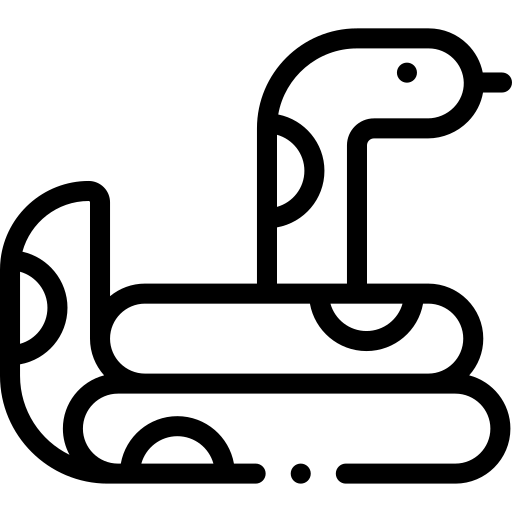

<!--
.. title: Show Me The Code
.. slug: show-me-the-code
.. date: 2022-04-27 11:23:57 UTC+03:00
.. type: text
-->

<header>
    <h1>Hello world!</h1>
    <h3> Use WASD / arrow keys to move snake around.</h3>
    <p>Click at any word/symbol and check out info in tooltip :)</p>
</header>
<section id="walkingContainer">
    
    <div id="tooltip" role="tooltip">foo spam eggs
        <div id="arrow" data-popper-arrow></div>
    </div>

```python
# By adding the line #!/usr/bin/python3 on the top of the script, we can run the file.py
# on a Unix system & automatically will understand that this is a python script.
# !/usr/bin/python3
"""A one line summary of the module or program, terminated by a period.

Leave one blank line.  The rest of this docstring should contain an
overall description of the module or program.  Optionally, it may also
contain a brief description of exported classes and functions and/or usage
examples.
PEP = Python Enhancement Proposal

  Typical usage example:

  foo = ClassFoo()
  bar = foo.function_bar()
"""
# ####### 1. Standard Library imports
import datetime
import importlib
import math
import os
import platform
import random
import sys
from copy import copy, deepcopy
from pprint import pprint

# ####### 2. 3rd-party packages
from colorama import Fore, Back, Style
import requests

# fyi: Such import style will cause issues with built-in funcs -
#  if names match, they'll be overridden.
# from os import *

# ####### 3. your own packages
# import < model_name > from < models_package >

GRAVITATIONAL_CONSTANT: float = 9.81

# Write a full sentence in one-line comment with a period in the end.
multiline_comment = '''
  Not a Module docstring \t but comment assigned to variable.\n This will be
  a second line if printed.
  '''
```

</section>

<script src="https://unpkg.com/@popperjs/core@2"></script>
<script>
    const snakeWithTooltip = document.querySelector('#walkingSnake');
    const emptyTooltip = document.querySelector('#tooltip');

    const popperInstance = Popper.createPopper(snakeWithTooltip, emptyTooltip, {
        placement: 'top',
        modifiers: [
            {
                name: 'offset',
                options: {
                    offset: [0, 8],
                },
            },
        ],
    });

    function show() {
        // Make the tooltip visible
        emptyTooltip.setAttribute('data-show', '');

        // Enable the event listeners
        popperInstance.setOptions((options) => ({
            ...options,
            modifiers: [
                ...options.modifiers,
                {name: 'eventListeners', enabled: true},
            ],
        }));

        // Update its position
        popperInstance.update();
    }

    function hide() {
        // Hide the tooltip
        emptyTooltip.removeAttribute('data-show');

        // Disable the event listeners
        popperInstance.setOptions((options) => ({
            ...options,
            modifiers: [
                ...options.modifiers,
                {name: 'eventListeners', enabled: false},
            ],
        }));
    }

    const showEvents = ['mouseenter', 'focus'];
    const hideEvents = ['mouseleave', 'blur'];

    showEvents.forEach((event) => {
        snakeWithTooltip.addEventListener(event, show);
    });

    hideEvents.forEach((event) => {
        snakeWithTooltip.addEventListener(event, hide);
    });
</script>
